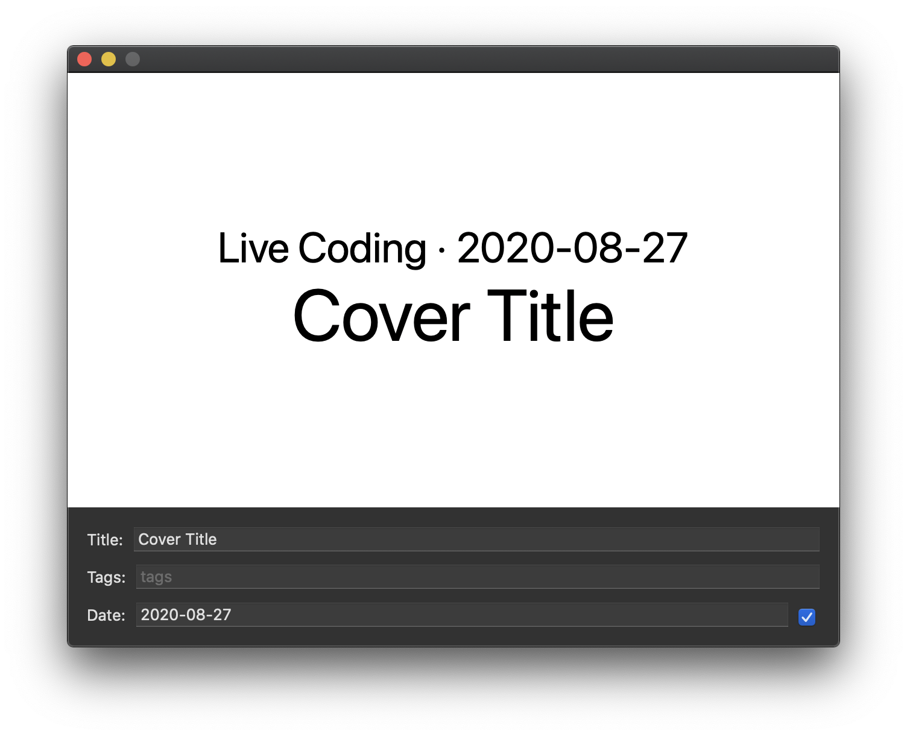

CoverMaker is a small macOS that generates YouTube video thumbnails for [my
channel](https://youtube.com/dduan).

It takes YouTube metadata for a video (manually input) and display it in a SwiftUI view. It can hide
everything else in the app except for the view, including Mac UI elements such as title bar and
window shadow. In this mode a screenshot of the app is the thumbnail in the right dimention. The two
modes can be toggled by double-click the content of the window.

The app is built with SwiftUI and [Composable
Architecture](https://github.com/pointfreeco/swift-composable-architecture). It's mostly written
from project creation to finish during a live stream, the archive of which can be viewed
[here](https://youtu.be/V2nQftXnd1M).

